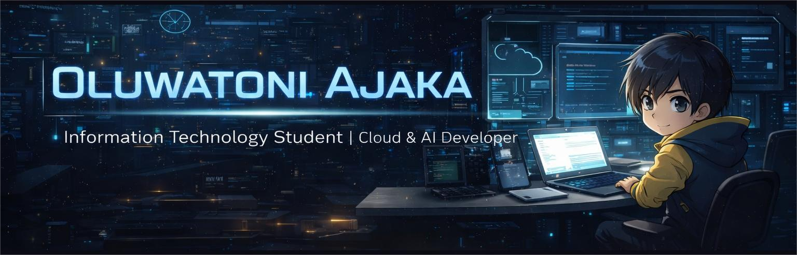

  

<h1 align="center">Hi 👋, I'm Oluwatoni Ajaka</h1>
<h3 align="center">Cloud & AI Developer | Information Technology Student | Building real-world systems with Python, AWS, Flask, Docker, LangChain, and PyTorch</h3>

  
  
  

---

  

---

## 🌙 About Me

- 🚀 I’m passionate about **cloud engineering, backend development, and AI-powered applications**
- 🧠 I’m currently learning **LangChain, PyTorch, and deeper cloud deployment workflows**
- ☁️ I enjoy building systems with **AWS, Docker, Flask, and Python**
- 🛠 I recently built and deployed a **Cloud-Based Face Recognition API** using **Flask, Docker, S3, Rekognition, DynamoDB, Lambda, and EC2**
- 🤝 I’m open to **internships, backend roles, cloud roles, and collaboration on practical projects**
- 💬 Ask me about **Python, AWS, Flask, Docker, APIs, and cloud-based projects**

---

## 🚀 Current Focus

- Building **cloud-native backend projects**
- Improving my **AWS deployment and architecture skills**
- Exploring **LLM app development with LangChain**
- Learning **PyTorch** for deeper ML understanding

---

## 🧩 Featured Project

### ☁️ Cloud-Based Face Recognition API
A real-world cloud project that combines **Flask**, **Docker**, **AWS Lambda**, **Amazon S3**, **Amazon Rekognition**, **DynamoDB**, and **EC2**.

#### Highlights
- 📸 Register faces through a REST API
- 🔍 Recognize uploaded faces with high similarity matching
- ⚡ Automatically index dataset images using **S3-triggered Lambda**
- 🗂 Store face metadata in **DynamoDB**
- 🐳 Containerized with **Docker**
- 🌍 Deployed on **Amazon EC2**

🔗 **Project Repo:**  
[Face Recognition Project](https://github.com/oluwatoni04/Face_rekognition)

---

## 🛠 Languages and Tools

  

---

## 📊 GitHub Stats

  
  

  

---

## 📌 What I’m Looking For

- 💼 Internship opportunities in **Cloud Computing**, **Backend Development**, or **AI/ML**
- 🤝 Collaboration on **cloud-based systems**, **automation tools**, and **AI apps**
- 📈 Opportunities to grow through **real production-style projects**

---

## 🌐 Connect With Me

  
  &nbsp;&nbsp;
  
  &nbsp;&nbsp;
  

---

## 💡 A Few Things About Me

- ⚙️ I like building things that actually work in the real world
- 📚 I learn best by turning tutorials into full projects
- 🔥 I’m especially interested in systems that combine **AI + Cloud + Backend**
- 🎯 My goal is to become a strong **Cloud / AI Engineer** with solid software engineering fundamentals

---

## 🧠 Quote I Like

  

---

## 🏆 Profile Views

  

